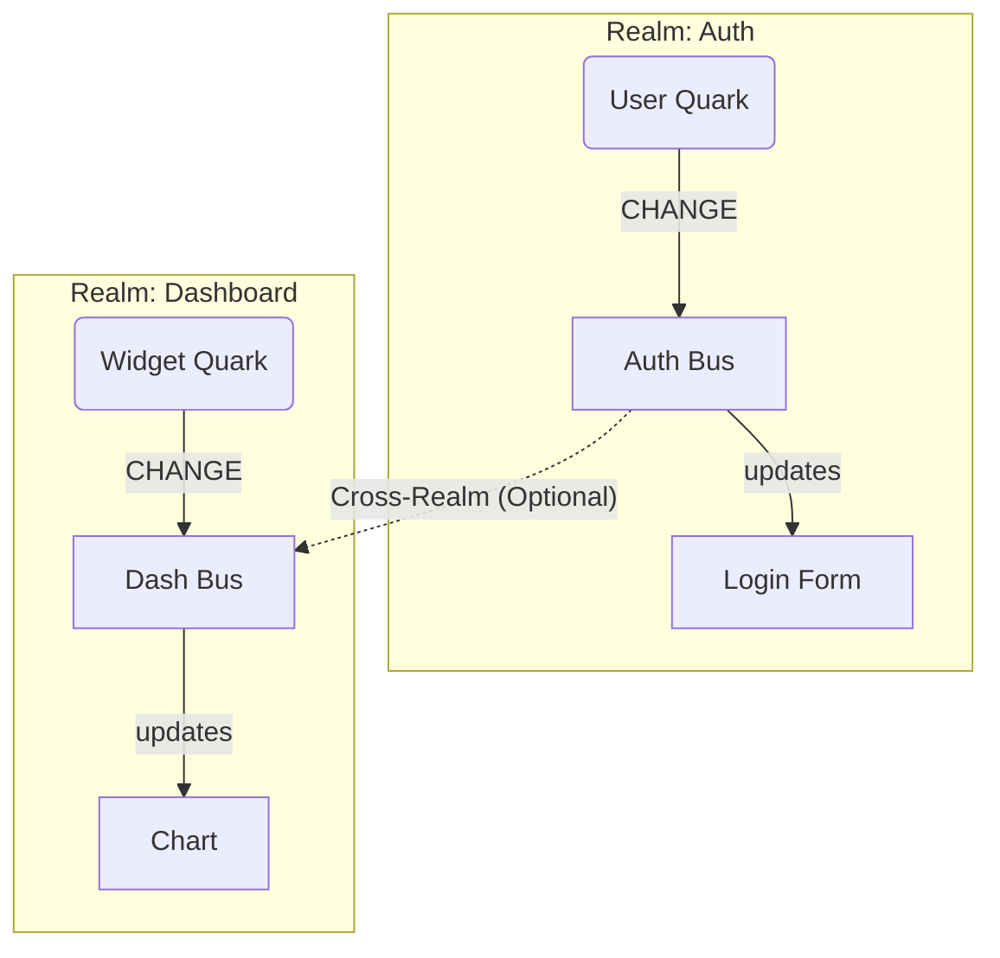

# Quark Concept: The Fundamental Particle

This document explains the core concepts behind `@alaq/quark` — the lowest-level building block of the Alaq ecosystem.

## 1. Quark: The Container of Value
In physics, quarks are fundamental constituents of matter. In Alaq, a **Quark** is the fundamental constituent of **State**.

Think of a Quark as a **smart box** that holds a single value.
- **Reactive:** When you change the value inside, the box emits energy (an event).
- **Independent:** It doesn't need a framework or a root store. It lives on its own.
- **Efficient:** It only notifies listeners when the value *actually* changes (deduplication).

```typescript
import { Qu } from '@alaq/quark'

// Create a quark
const speed = Qu({ value: 0 })

// 1. Direct Reactivity (using .up method)
// 'up' stands for "update" or "hooking up" to the value.
speed.up(val => console.log('Speed is now:', val))

// Change value -> Notifies listeners
speed(100) 
```

## 2. Quantum Bus: The Nervous System
Quarks don't just sit there; they communicate. Instead of hard-wiring every quark to every listener (which creates "spaghetti code"), we use a central nervous system called the **Quantum Bus**.

When a Quark changes, it emits a signal into the Bus.
Listeners tune into the Bus to react.

- **Decoupled:** The sender doesn't know who is listening.
- **Fast:** Optimized for thousands of events per second.
- **Standardized:** All signals follow the `{ id, value }` format.

```typescript
import { Qu, quantumBus, CHANGE } from '@alaq/quark'

// Create a named quark in a realm
const temperature = Qu({ 
  realm: 'sensors', 
  id: 'temp', 
  value: 20 
})

// Listen via the Bus (Distributed Reactivity)
const bus = quantumBus.getRealm('sensors')

bus.on(CHANGE, (event) => {
  // event is { id: 'temp', value: 20 }
  console.log(`Sensor ${event.id} changed to ${event.value}`)
})

// Update
temperature(25)
```

## 3. Realm: The Universe Context
If every Quark shouted into the same room, it would be chaotic. To solve this, we use **Realms**.

A **Realm** is a named, isolated "universe" or "channel" on the Quantum Bus.

### Why use Realms?
1.  **Isolation:** You can have a `UserRealm` and a `SettingsRealm`. Events in one don't disturb the other.
2.  **Micro-Frontends:** Two independent widgets can use the same variable names (e.g., `isOpen`) if they are in different realms, without collision.
3.  **Debugging:** You can listen to `realm: 'auth'` and see only authentication events.

### Visualization



## Summary
- **Quark** = Data + Reactivity (The "Atom" of state).
- **.up()** = Direct subscription.
- **Quantum Bus** = The signal highway (`bus.on`).
- **Realm** = The frequency or channel on that highway.