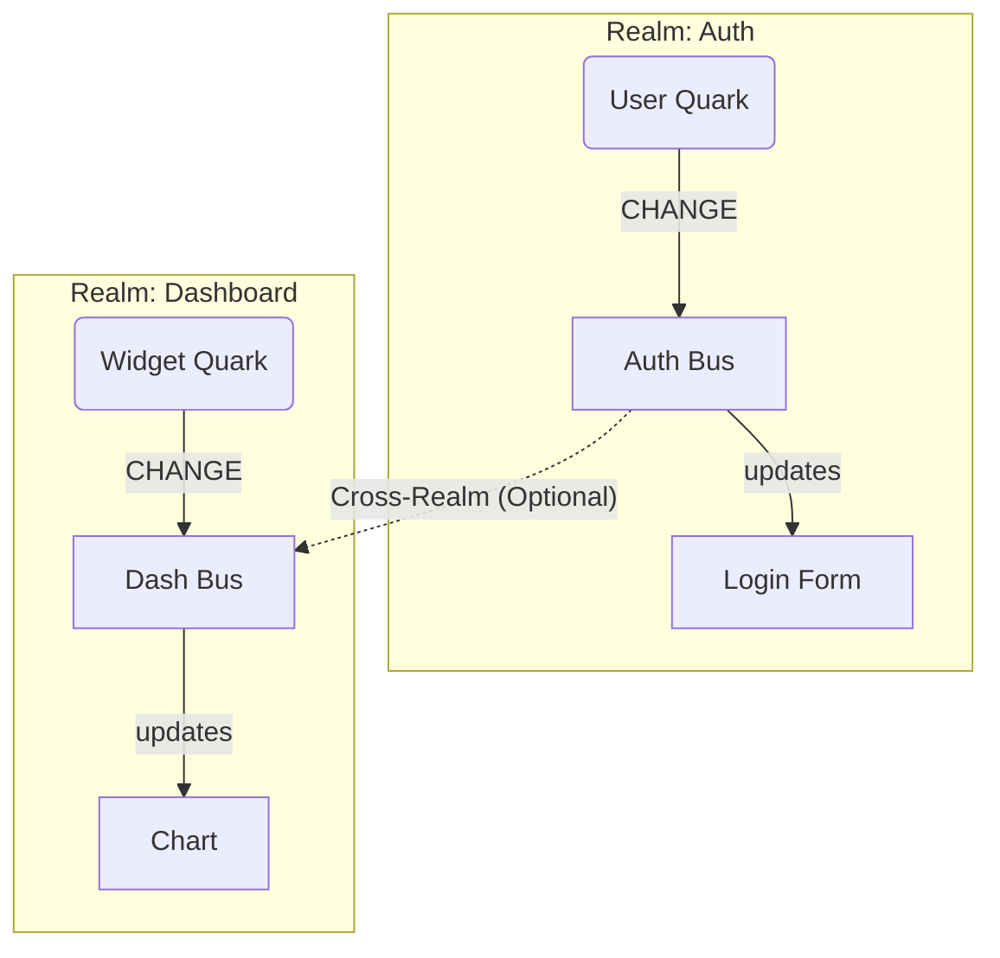

# Концепция Quark: Фундаментальная Частица

Этот документ описывает ключевые принципы `@alaq/quark` — базового строительного блока экосистемы Alaq.

## 1. Quark: Контейнер Значения
В физике кварки — фундаментальные составляющие материи. В Alaq **Quark (Кварк)** — фундаментальная составляющая **State (Состояния)**.

Кварк представляет собой контейнер, хранящий единичное значение.
- **Реактивность:** При изменении значения инициируется событие.
- **Автономность:** Функционирует независимо от внешних фреймворков или корневых хранилищ.
- **Эффективность:** Уведомление слушателей происходит только при фактическом изменении значения (автоматическая дедупликация).

```typescript
import { Qu } from '@alaq/quark'

// Инициализация кварка
const speed = Qu({ value: 0 })

// 1. Прямая Реактивность (метод .up)
speed.up(val => console.log('Скорость:', val))

// Изменение значения и уведомление подписчиков
speed(100) 
```

## 2. Quantum Bus: Система Коммуникации
Для организации взаимодействия между независимыми кварками используется централизованная система сообщений — **Quantum Bus (Квантовая Шина)**.

Изменение состояния Кварка генерирует сигнал в Шину. Подписчики реагируют на сигналы определенных каналов.

- **Слабая связность (Decoupling):** Источник события не осведомлен о получателях.
- **Производительность:** Оптимизировано для обработки высокочастотных потоков событий.
- **Стандартизация:** Формат сигналов унифицирован: `{ id, value }`.

```typescript
import { Qu, quantumBus, CHANGE } from '@alaq/quark'

// Кварк в Realm 'sensors'
const temperature = Qu({ 
  realm: 'sensors', 
  id: 'temp', 
  value: 20 
})

// Подписка через Шину (Распределенная Реактивность)
const bus = quantumBus.getRealm('sensors')

bus.on(CHANGE, (event) => {
  // event: { id: 'temp', value: 20 }
  console.log(`Датчик ${event.id}: ${event.value}`)
})

// Обновление состояния
temperature(25)
```

## 3. Realm: Контекст Вселенной
Для предотвращения коллизий имен и логического разделения потоков данных используется концепция **Realms (Миров)**.

**Realm (Мир)** — именованное, изолированное пространство событий на Quantum Bus (Квантовой Шине).

### Назначение Realms (Миров)
1.  **Изоляция:** Разделение доменов данных (например, `UserRealm` и `SettingsRealm`) исключает взаимное влияние.
2.  **Модульность:** Независимые компоненты могут использовать идентичные идентификаторы переменных в разных Realms (Мирах) без конфликтов.
3.  **Отладка:** Возможность фильтрации событий по конкретному Realm (Миру) (например, только события `auth`).

### Схема взаимодействия



## Резюме
- **Quark** — Данные + Реактивность.
- **.up()** — Метод прямой подписки.
- **Quantum Bus** — Среда передачи сигналов.
- **Realm (Мир)** — Изолированный канал коммуникации.